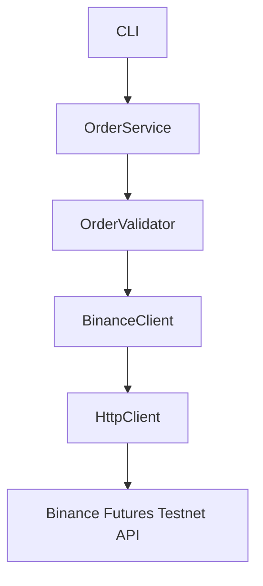

# Trading Bot

A Python-based Binance Futures testnet trading bot with a CLI workflow for placing and checking orders.

## Features

- Binance Futures API integration for testnet requests
- Order placement for MARKET and LIMIT orders
- Order lookup and cancellation support
- Typed request/response models with Pydantic
- Centralized configuration and logging
- Automated tests for auth and Binance client behavior

## Project Structure

```text
Trading_Bot/
├── api/
│   ├── __init__.py
│   ├── auth.py
│   ├── binance_client.py
│   ├── client.py
│   └── endpoints.py
├── core/
│   ├── __init__.py
│   ├── config.py
│   ├── constants.py
│   ├── exceptions.py
│   └── logger.py
├── logs/
├── models/
│   ├── __init__.py
│   ├── enums.py
│   ├── order.py
│   └── response.py
├── services/
│   ├── __init__.py
│   └── order_service.py
├── tests/
│   ├── test_api_imports.py
│   ├── test_auth.py
│   └── test_binance_client.py
├── validators/
│   ├── __init__.py
│   └── order_validator.py
├── .env
├── .env.example
├── cli.py
├── main.py
├── pyproject.toml
├── README.md
├── requirements.txt
└── uv.lock
```

## Architecture



## Requirements

- Python 3.8+
- pip or uv

## Installation

### Using uv

```bash
pip install uv
uv pip install -e .
```

### Using pip

```bash
pip install -r requirements.txt
```

## Configuration

1. Create a local environment file from the example:

```bash
copy .env.example .env
```

2. Fill in your Binance credentials:

```env
BINANCE_API_KEY=your_api_key_here
BINANCE_SECRET_KEY=your_secret_key_here
BINANCE_BASE_URL=https://testnet.binancefuture.com
LOG_LEVEL=INFO
```

> Keep the .env file local and never commit it.

## Usage

### CLI

```bash
python cli.py --help
```

Example order placement:

```bash
python cli.py --symbol BTCUSDT --side BUY --type MARKET --quantity 0.001
python cli.py --symbol BTCUSDT --side BUY --type LIMIT --quantity 0.001 --price 50000
```

### Entry point

```bash
python main.py --help
```

## Testing

```bash
python -m pytest -q
```

## Logging

Application logs are written to the logs directory, with the main file at logs/trading.log.

## Environment Variables

| Variable | Required | Default | Description |
|----------|----------|---------|-------------|
| BINANCE_API_KEY | Yes | - | Binance API key |
| BINANCE_SECRET_KEY | Yes | - | Binance secret key |
| BINANCE_BASE_URL | No | https://testnet.binancefuture.com | Binance API base URL |
| LOG_LEVEL | No | INFO | Logging verbosity |
| LOG_FILE | No | logs/trading.log | Log file path |
| TIMEOUT | No | 10 | HTTP timeout in seconds |

## License

MIT

## Security Notes

- Never commit your .env file or API keys to version control.
- Use Binance testnet for development and validation.
- Restrict API key permissions to the minimum required.
